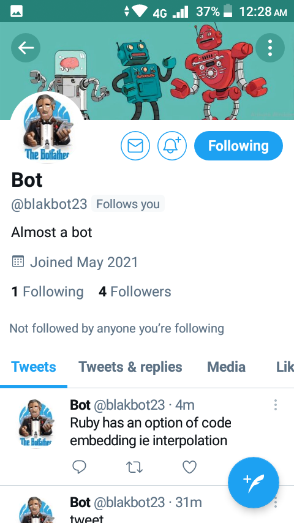

# Twitter Bot
Blakbot23 is a twitter bot built with ruby. It can tweet, retweet and reply to mentions. At different time intervals, it tweets fun factual facts about ruby, retweets tweets about coding in general and searches and replies to mentions. For the mentions, it can answer salutation, purpose, and opinion questions.

## Built with
Ruby

## Prerequisites
A Twitter account

## Getting started
To access the code to this bot,
1. Clone this repo to a directory of your choosing
2. Run bundle install

## Setup
After cloning the repo and installing the required gems by running bundle install, the next thing you need is to get access to the bot account. To do this, 
1. Log in into your twitter developer account. Developer.twitter.com to get api and token keys.
2. Copy the four keys 
3. In the project directory navigate to bin/main.rb file
4. Replace the four keys on the file with your new access keys. For example

Alternatively, you can find these keys in the project review request form.

## Run tests
Run rspec in your terminal to run tests.

## Usage
To interact the bot, simply mention it in one of your tweets @blakbot23, or visit the home page to see some of its tweets and retweets.

## Authors
- GitHub: [@Blakbox23](https://github.com/blakbox23)
- Twitter: [@blakbox23](https://twitter.com/blakbox23)
- LinkedIn: [Peter Mbuthia](https://www.linkedin.com/in/peter-mbuthia-b15791182/)

## 🤝 Contributing

Contributions, issues, and feature requests are welcome!

Feel free to check the [issues page](https://github.com/blakbox23/bot/issues).

## Show your support

Give a ⭐️ if you like this project!

## Acknowledgments

- Learning partner [Zeenat Lawal](https://github.com/ZeenatLawal), 
- [Baraka Mukelenga](https://github.com/barackm)

## 📝 License

This project is [MIT](https://github.com/git/git-scm.com/blob/master/MIT-LICENSE.txt) licensed.
